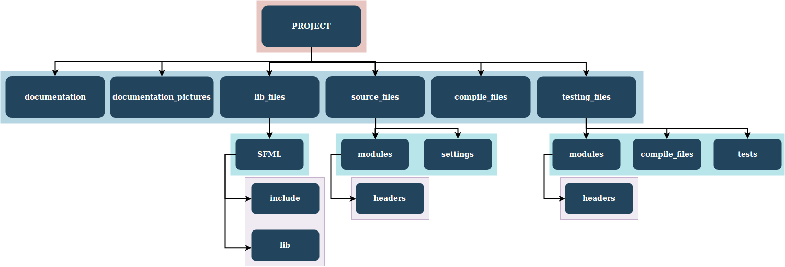

# Geometric battle

## Gameplay

Управление передвижением производится с помощью клавиатуры **`W-A-S-D`**.

Управление атакой с помощью стрелок на клавиатуре `↑←↓→`.

## Catalogs description

* В каталоге `documentation` расположены файлы с описанием игрового процесса, архитектурных решений, используемых в коде, а также некоторых реализационных моментов.

* В каталоге `documentation_pictures` расположены вспомогательные файлы с диаграммами, используемые в документации проекта.

* В каталоге `compile_files` расположены `cmake` файлы для сборки проекта игры.

* В каталоге `lib_files` расположены файлы используемой библиотеки `SFML`.

* В каталоге `source_files` расположены исходные файлы проекта.

  * В подкаталоге `settings` расположены файлы с настройками игры - константами, используемыми внутри кода проекта.

  * В подкаталоге `modules` расположены файлы с кодом игры, разбитые на тематические модули. Внутри подкаталога `headers` расположены подключаемые хедеры.

* В каталоге `testing_files` расположены файлы, используемые для тестирования проекта.

  * В подкаталоге `compile_files` расположены `cmake` файлы для сборки проекта вместе с тестирующим модулем.

  * В подкаталоге `tests` расположены файлы - тесты.

  * В подкаталоге `modules` расположены файлы с реализацией модулей, способствующих тестированию.

* В каталоге `logs` создается файл с логами игрового процесса.

* В каталоге `fonts` расположен файл с используемым шрифтом.



## Usage example

Скомпилировать игру.

```
bash compile_game.sh
```

Запустить игру. У скрипта три параметра, первые два принимают строку `Circle` или `Square`. Первый параметр отвечает за тип вражеских юнитов, второй за тип игрового персонажа. Третий параметр, беззнаковое 16-битовое число, задает сид для генерации.

```
bash run_game.sh Circle Square 123
```

**Для тестирования используется библиотека `Boost`, её необходимо установить для запуска тестирования.**

Скомпилировать тесты.

```
bash compile_tests.sh
```

Запустить тесты.

```
bash run_tests.sh
```
