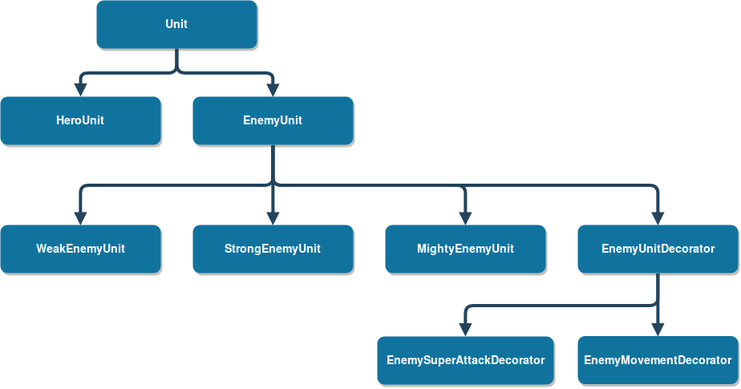
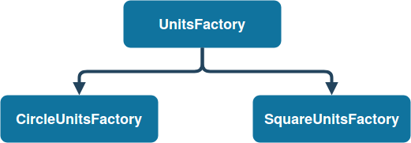
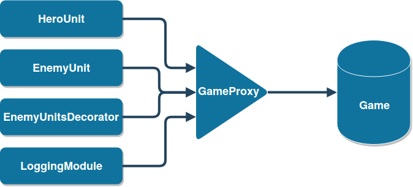
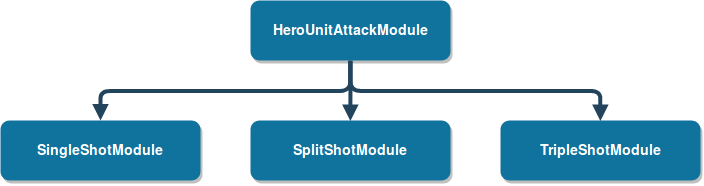
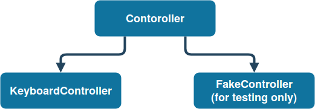

# Architectural solutions

**1) Абстрактный класс `Unit`**

У вражеских юнитов и юнита главного персонажа, которым управляет игрок, есть несколько общих полей: позиция, урон, запас здоровья, геометрическая форма и другие - и методов, например, функция `update(time)` обновляющая игровую логику юнита. Поэтому удобным решением будет создание абстрактного класса `Unit`, от которого будут унаследованы классы `HeroUnit`, класс главного юнита, и `EnemyUnit`, класс вражеских юнитов.

**2) Паттерн `Abstract Factory`**

В начале игры мы узнаем тип вражеских юнитов, т.е. геометрическую форму, но все три цвета: красный, зеленый, синий - будут использоваться вне зависимости от изначального выбора типа. Поэтому удобно использовать паттерн `Abstract Factory`. Создадим абстрактный класс `EnemyUnit`, от которого будут наследоваться три класса: `WeakEnemyUnit`, `StrongEnemyUnit`, `MightyEnemyUnit` - красный, синий и зеленый вражеский юнит соответственно.

Также создадим абстрактный класс - абстрактную фабрику `UnitsFactory`, у которой есть методы, позволяющие создать вражеского юнита конкретного цвета. От этого класса будут наследоваться два класса: `СircleUnitsFactory`, `SquareUnitsFactory` - две фабрики, по одной на каждую геометрическую форму вражеского юнита, позволяющие создавать вражеских юнитов разных цветов, но одной геометрической формы.

**3) Паттерн `Singleton` в реализации классов `СircleUnitsFactory`, `SquareUnitsFactory`**

Т.к. нам нужно только по одной сущности каждой из фабрик (не логично создавать несколько их копий, т.к. одна может справиться со всей работой) логично использовать паттерн `Singleton`.

**4) Паттерн `Decorator`**

Для реализации добавления супер атаки или способности передвигаться вражескому юниту удобно использовать паттерн `Decorator`. Использование обертки над реальным юнитом позволит не менять старый код работы с вражескими юнитами, но добавить новый функционал. Для реализации этого паттерна удобно, чтобы все обращение с объектами класса `EnemyUnit` происходило через функции, поэтому уберем все поля в приватную секцию, но добавим публичные геттеры. Класс `EnemyUnitDecorator` нужен только для того, чтобы переопределить в нем эти самые геттеры на вызов их у обернутого объекта. Без этого класса пришлось бы делать это во всех декораторах.

**5) Класс `HeroUnit`**

Внутри класса `HeroUnit` появляются новые поля: контроллер, список модулей атаки (пункт 7). Кроме того изменяется реализация функций передвижения и стрельбы.

**6) Паттерн `Proxy`, класс `GameProxy`**

В классе `Game` (пункт 10) хранятся все игровые объекты. В обновлении логики, например, главного персонажа или вражеских юнитов, необходимо получать уже предобработанную информацию на основе данных, содержащихся в классе `Game`. Т.е. класс `Game` в данном случае выступает в роли своеобразной базы данных. Возникает необходимость в создании не столько интерфейса обращения к данным из класса `Game`, сколько объекта, связанного с объектом класса `Game`, умеющего ответь на конкретные запросы.

Удобным решением будет создание класса `GameProxy`, реализованного на основе паттерна `Proxy`. Через него юниты могут отдавать информацию для создания и хранения произведенных выстрелов. А модуль логирования (пункт 8) подтягивает прошедшее время со старта игры.

**7) Паттерн `Strategy`, класс `HeroUnitAttackModule`**

Во время игры тип атаки главного персонажа должен изменяться. Смена происходит после убийства заданного количества вражеских юнитов. Типы атаки сменяются циклически.

В данном случае удобно использовать паттерн `Strategy`, т.к. есть необходимость менять реализацию одной и той же функциональности (модуль атаки героя) во время работы программы. Поэтому обернем реализацию этой функциональности в класс. Есть три типа атаки - *single*, *split*, *triple*. Создадим абстрактный класс `HeroUnitAttackModule`, от которого будут наследоваться описанные ранее классы с различными реализациями модуля атаки главного героя.

Паттерн `Strategy` подходит здесь больше, чем паттерн `Command`, т.к. паттерн `Strategy`описывает разные способы произвести одно и то же действие (в нашем случае описывают реализацию модуля атаки), а паттерн `command` скорее используют, чтобы превратить любые разнородные действия в объекты.

**8) Паттерн `Visitor`, класс `LoggingModule`**

Сделаем логирование внутриигровых событий. Но изменять класс `Unit` и наследуемые от него классы не будем. Тогда создадим класс `LoggingModule`, который будем отвечать за логирование. Реализуем в нем методы `created(unit)` и `killed(unit)`, которые принимают юнита, и записывают в лог соответствующее событие с какой-нибудь дополнительной информацией, например, время события, позиция юнита, характеристики юнита.

Для реализации такого класса `LoggingModule` удобно использовать паттерн `Visitor`. Т.е. мы добавим новую функциональность без изменения старых классов. Кроме того у нас есть всего две функции, но для разных объектов из иерархии класса `Unit` они должны работать немного по-разному. Поэтому удобно реализовать внутри класса `LoggingModule` несколько версий методов `created(unit)` и `killed(unit)` для конкретных типов (листов) из дерева иерархии класса `Unit`.

**9) Паттерн `Observer`, класс `EnemyUnitsBooster`**

Класс `EnemyUnitsBooster` будет отвечать за усиление вражеских юнитов со временем. Конкретнее: при убийстве вражеского юнита, все вражеских юниты, которые заспавнились до него, должны стать немного сильнее. Реализуем внутри класса `EnemyUnit` функцию `upgrade()`, которая и будет отвечать за это усиление юнита. Эта функция может быть перегружена у конкретных реализаций вражеских юнитов. Остается реализация самого класса `EnemyUnitsBooster`.

Для этого использован паттерн `Observer`. Внутри класса `EnemyUnitsBooster` содержится список с указателя на вражеских юнитов. Так же у него есть метод `addEnemyUnit(enemy_unit)`, позволяющий добавлять (subscribe) вражеских юнитов, и метод `update()`, который вызывается при смерти одного из вражеских юнитов. Метод `update()` пробегается по списку, вызывая по пути метод `upgrade()` у вражеских юнитов, до первого убитого юнита, после чего цикл останавливается.

**10) Классы `Window`, `Controller` и `KeyboardController`, `Game`**

* Класс `Window` будет содержать методы позволяющие работать с графической библиотекой. Все обращения к методам библиотеки сокрыты именно здесь.

* Класс `KeyboardController` унаследован от абстрактного класса `Controller`. Вся логика взаимодействие с контроллером описана именно здесь. Абстрактный класс позволяет использовать различные контроллеры для игры с единым внутренним интерфейсом. Также такая реализация упрощает добавление поддержки новых контроллеров для игры. Конкретно класс `KeyboardController` реализует управление игровой логикой с помощью клавиатуры. Класс `FakeController`, указанный на диаграме ниже, используется только в тестирующем модуле и реализует свою специфичную логику.

* Класс `Game` внутри себя хранит все объекты, содержащиеся в игре, например, фабрику для создания вражеских юнитов, массив вражеских юнитов, массив их пуль, главного персонажа (объект класса `UnitHero`), и массив их пуль.

В явном виде паттерн `Singleton` здесь не используется, т.к. и так будет создано только по одной сущности классов `Window` и `Game` в функции `main`, и `Controller` внутри объекта класса `UnitHero`.

**11) Класc `TestingModule`**

Для тестирования приватных методов описанных выше классов используется вспомогательный класс `TestingModule`. Он является другом классов, к которым происходит обращение при тестировании. Таким образом, такое решение помогает минимально изменять исходный код. Также реализация класса `TestingModule` и других модулей, используемых для тестирования, отделена от исходного кода проекта.

**12) Паттерн `Composite`**

Паттерн `Composite` не был использован в проекте. Возможное его применение можно увидеть в реализации функции, отвечающей за появление вражеских юнитов и их иерархии. Но с учетом всех выше описанных паттернов каждый вражеский юнит на практики получается практически уникальным, кроме того на поле может присутствовать большое количество юнитов одновременно. Таким образом, структура дерева бы просто превратилась в подобие графа-метелки без ручки, но в таком случае можно использовать и обычный вектор для хранения юнитов.

# Implementation solutions

* В качестве графического модуля используется библиотека `SFML`.

* Для тестирования используется библиотека `Boost`.

* В файле `main.cpp` в функции `main` находится главный цикл игры, таймер, а также вызов методов для обновления игровой логики и графического интерфейса.

* Паттерн `Singleton` реализован по примеру Скотта Майерса (Scott Meyers).

* В проекте используются умные указатели из стандартной библиотеки.

* При сборки проекта для тестирования указывается definition `-DTESTING_MODE`. Без него классы проекта не будут друзьями класса `TestingModule`.
